<h1 align="center">物联网平台 - Labdatahub-iot</h1>

  
  
  
  

## 🌟 项目简介

一个功能完备、高可扩展的物联网平台，提供完整的设备接入、管理和数据处理解决方案。支持多种网络协议，具备强大的消息解析和实时告警能力，帮助企业快速构建物联网应用。

## 演示地址
##### 演示使用，请不要暴力测试和修改密码，谢谢。

###### http://47.109.145.72:28082/
###### 账号:admin 密码:admin123

## 🚀 核心特性

### 1. 设备全生命周期管理
- **状态监控** - 实时设备在线状态跟踪，多种在离线模式
- **数据清理** - 设备可单独配置消息保存时间，到期自动删除

### 2. 多协议接入支持
- **TCP** - 稳定可靠的长连接通信
- **MQTT** - 轻量级的发布订阅模式
- **UDP** - 高效的低延迟数据传输
- **CoAP** - 专为受限设备设计的协议
- **HTTP** - 标准的RESTful接口
- **WebSocket** - 实时双向通信
- **MODBUS(开发中)** - 工业物联网设备协议

### 3. 智能消息解析
- **协议适配** - 多种数据格式解析（JSON、二进制、自定义）
- **数据转换** - 灵活的数据格式转换和归一化
- **规则引擎** - 可配置的数据处理规则

### 4. 实时告警系统
- **阈值告警** - 可配置的数据阈值监控
- **规则引擎** - 灵活的告警规则定义
- **多通道通知(开发中)** - 邮件、短信、Webhook等多种通知方式
- **告警分级** - 多级别告警管理

### 5. 远程功能下发
- **指令管理** - 统一的指令下发接口
- **自动下发** - 触发告警后自动下发相应指令
- **历史记录** - 手动\告警触发指令执行记录

## 🏗️ 系统架构

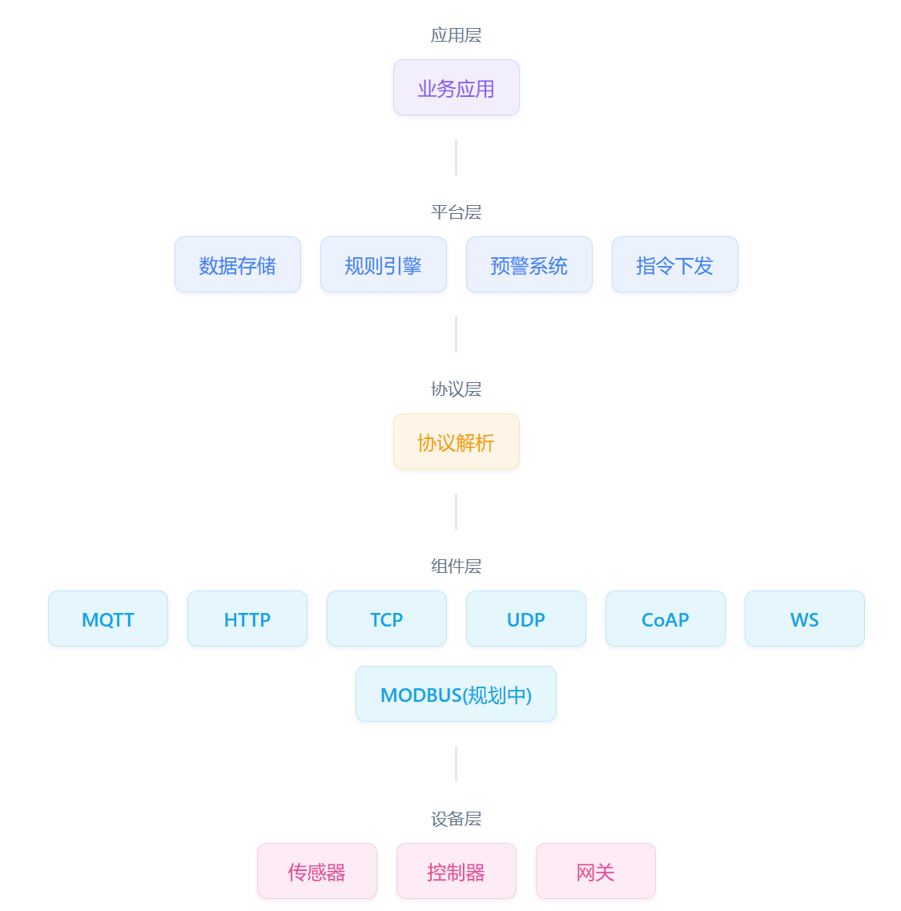

## 🛠️ 快速开始
#### 1、首页
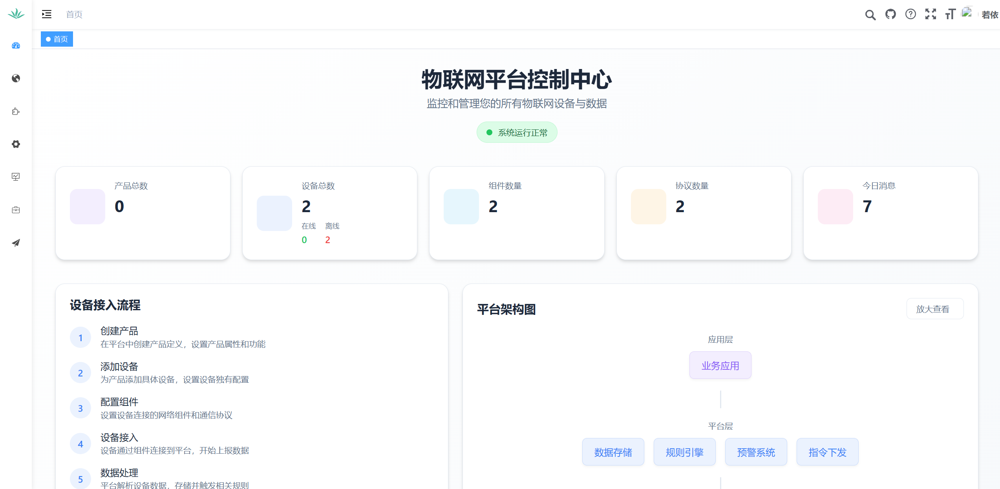
#### 2、产品管理
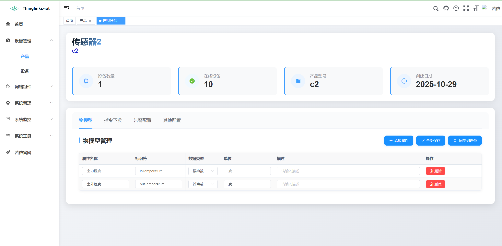
#### 3、告警配置
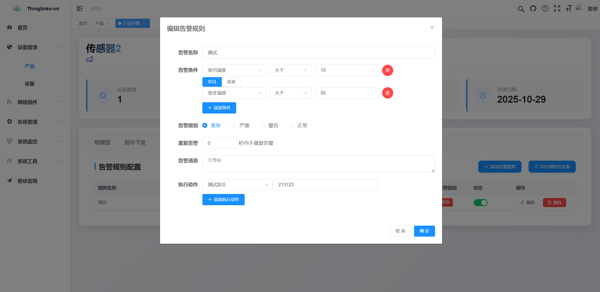
#### 4、实时数据
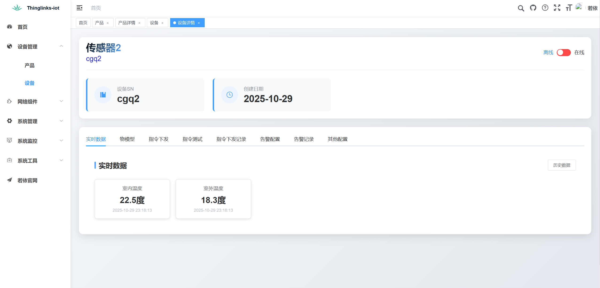
#### 5、指令下发
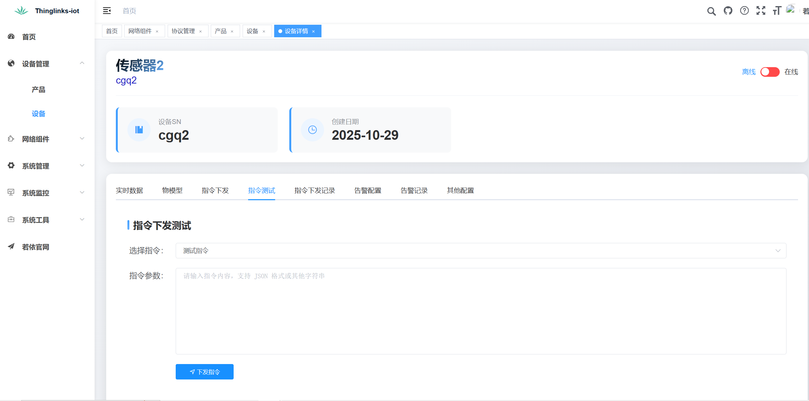
#### 6、物模型
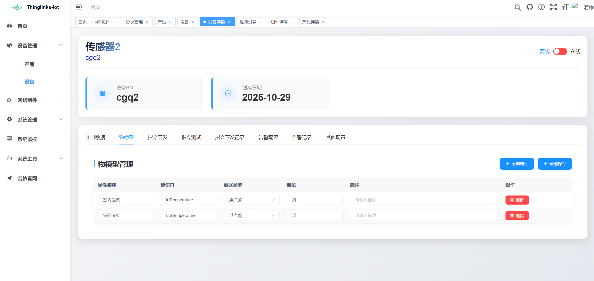
#### 7、告警记录
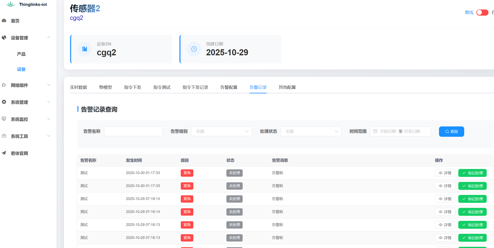
#### 8、其他配置
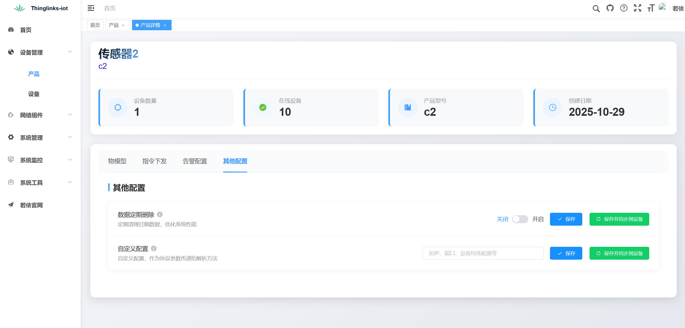
#### 9、网络组件
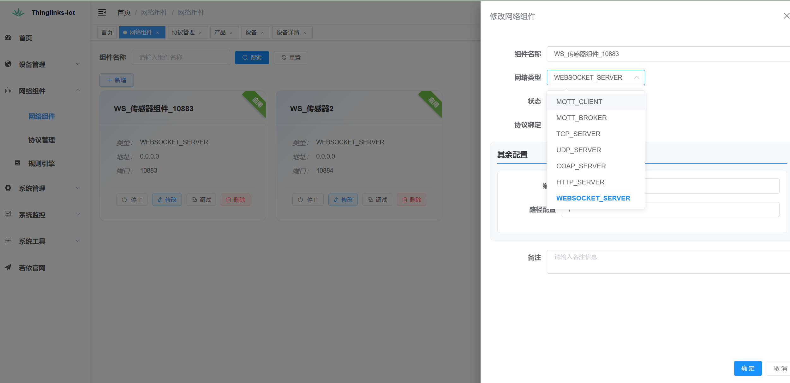
#### 10、组件调试
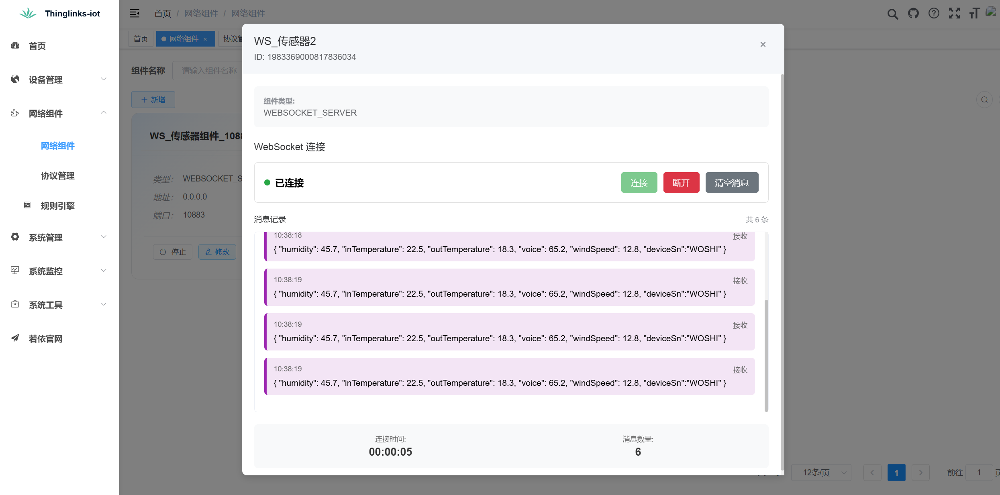
#### 11、协议管理
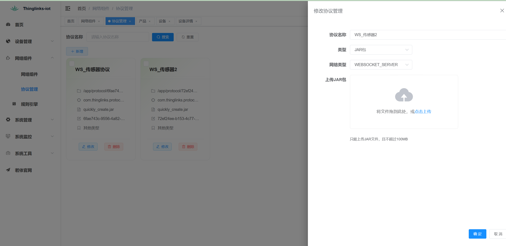
#### 12、规则引擎
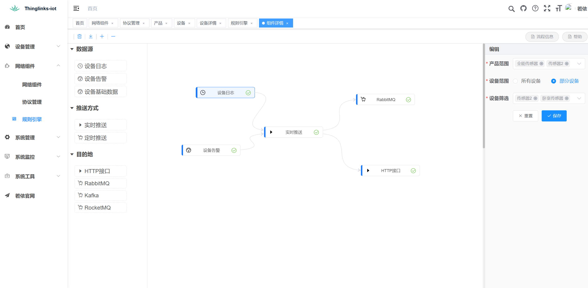
### 环境要求
###### JDK >= 1.8
###### MySQL >= 5.7
###### Maven >= 3.0
###### Node >= 12
###### Redis >= 3
### 协议包在代码同级目录 protocol.zip
## 📊 社区版 vs 企业版

| 功能特性        | 社区版 | 企业版           |
|-------------|----|---------------|
| **设备接入**    |    |               |
| 最大设备数量      | 无限制 | 无限制           |
| MQTT_CLIENT | ✅  | ✅             |
| TCP         | ✅  | ✅             |
| MQTT_BROKER | ❌  | ✅             |
| HTTP        | ❌  | ✅             |
| COAP        | ❌  | ✅             |
| UDP         | ❌  | ✅             |
| WEBSOCKET   | ❌  | ✅             |
| MODBUS      | ❌  | ✅        |
| **数据处理**    |    |               |
| 消息解析        | ✅  | ✅             |
| 规则引擎        | ❌  | ✅可视化规则引擎 |
| **系统功能**    |    |               |
| 实时数据监控      | ✅  | ✅             |
| 设备状态监控方式    | 心跳 | 网关、长连接、心跳     |
| 指令下发        | ✅  | ✅             |
| 告警配置        | ✅  | ✅             |
| 告警自动执行指令    | ❌  | ✅             |
| 设备自注册       | ❌  | ✅             |
| **管理功能**    |    |               |
| 用户权限        | ✅  | ✅             |
| 项目管理        | ✅  | ✅             |
| 审计日志        | ✅  | ✅             |
| **服务支持**    |    |               |
| 技术支持        | 社区支持 | 专属技术支持        |
| 更新保障        | ❌  | ✅             |
| 定制开发        | ❌  | ✅             |

### 企业版 ￥8888 可永久享受最新代码。

### 安装部署
请参考若依框架安装教程 传送门：https://www.ruoyi.vip/

### 特别鸣谢
本项目基础框架采用 若依框架 https://www.ruoyi.vip/

### 商务合作请联系：邮箱 1738450125@qq.com

### ⭐ 支持项目
如果这个项目对您有帮助，请给我们一个 Star！您的支持是我们持续更新的动力。

